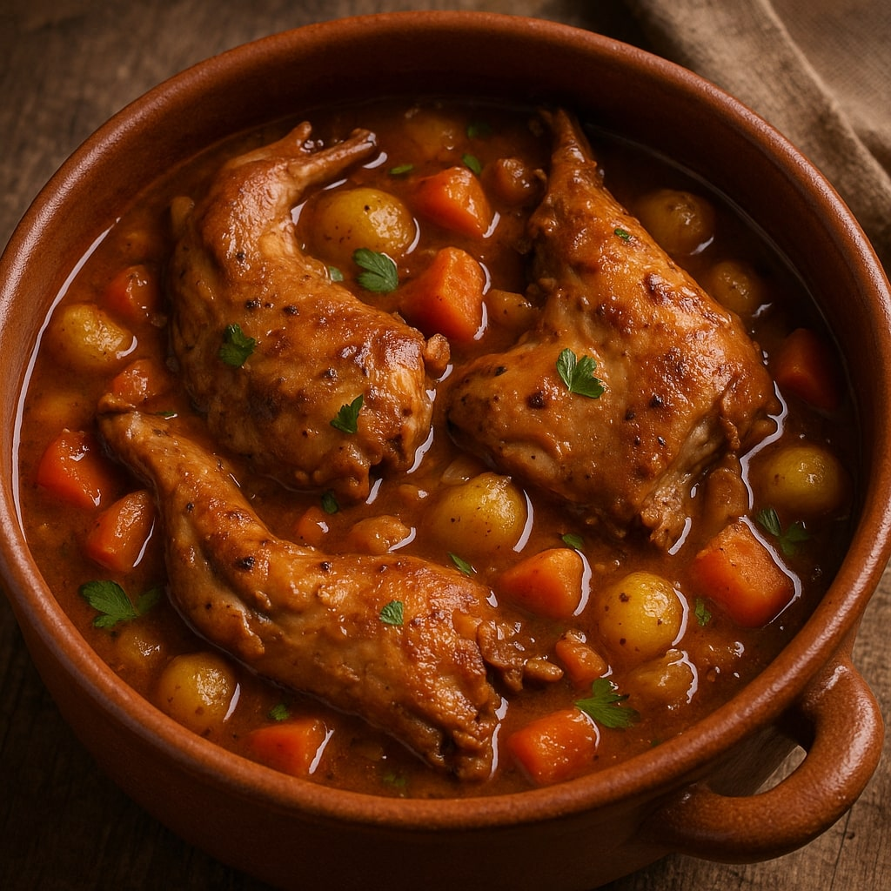

## Rabbit Stew 🐇🥕
A hearty retro classic.

**Ingredients**
- 2 rabbits
- 3 carrots
- 2 potatoes
- 1 onion

**Directions**
1. Brown rabbit pieces.
2. Add vegetables and simmer 2 hours.
3. Serve with crusty bread.

